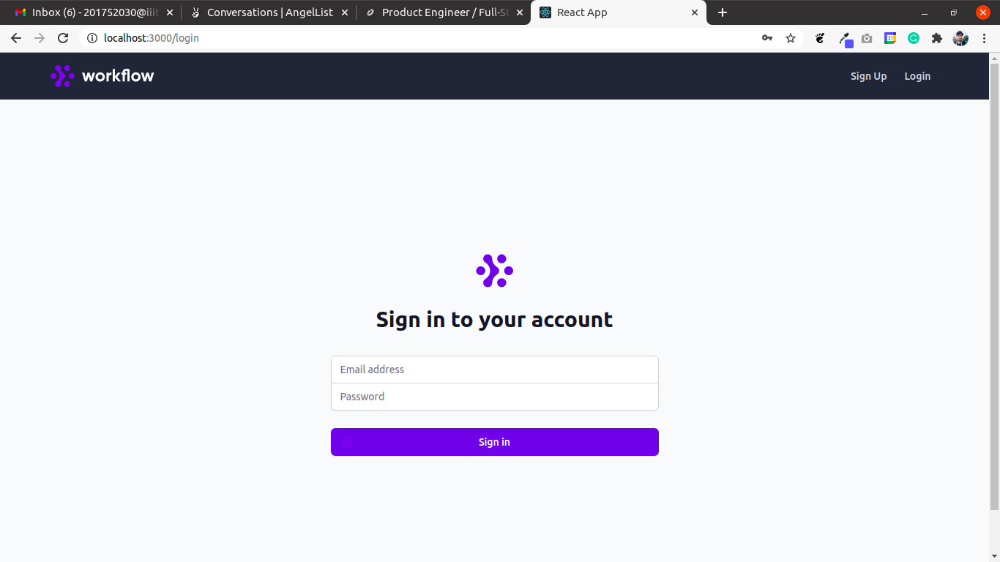
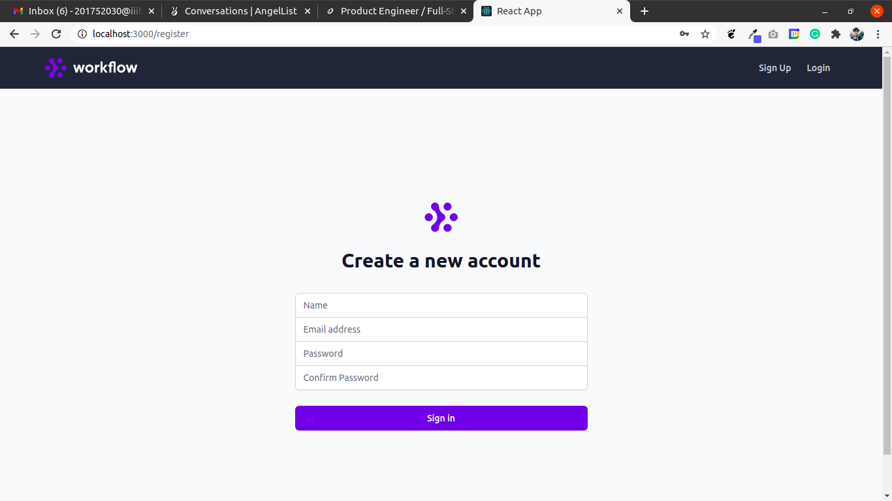
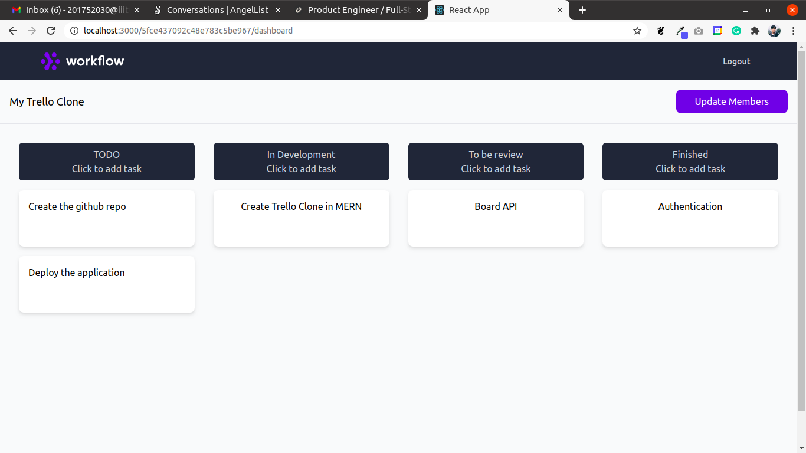
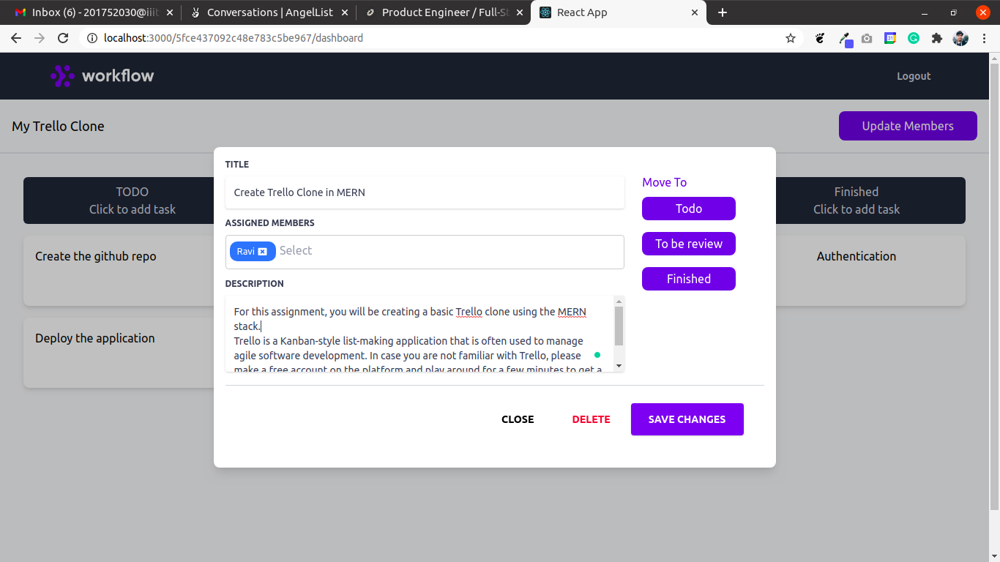

# Trello Clone

A basic trello clone built in MERN Stack

#### Requirements

- Nodejs 12.x and npm 6.x
- Local mongodb server

### How to Run the project locally

```
git clone https://github.com/ravivarshney01/trello-clone
```

```
cd backend
```

```
yarn
```

```
yarn start
```

> Leave the server running and open a new terminal

```
cd frontend
```

```
yarn
```

```
yarn start
```

### Screnshots





